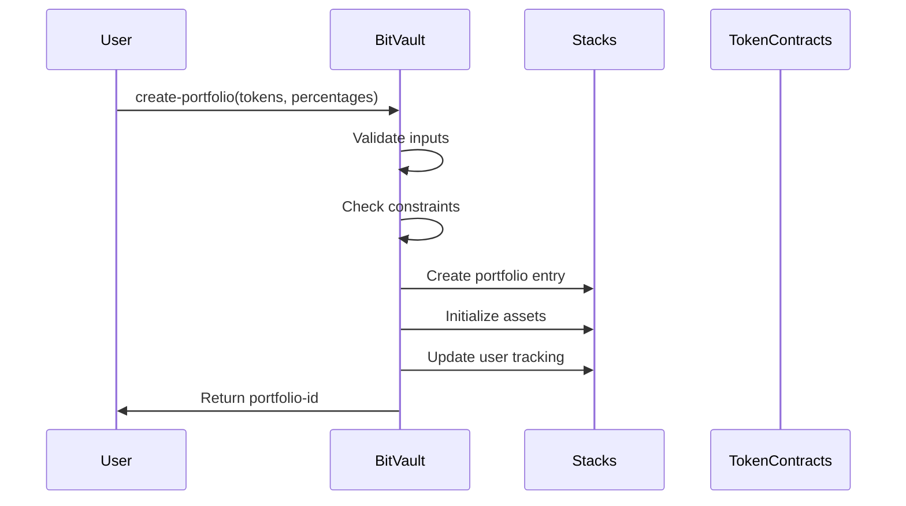
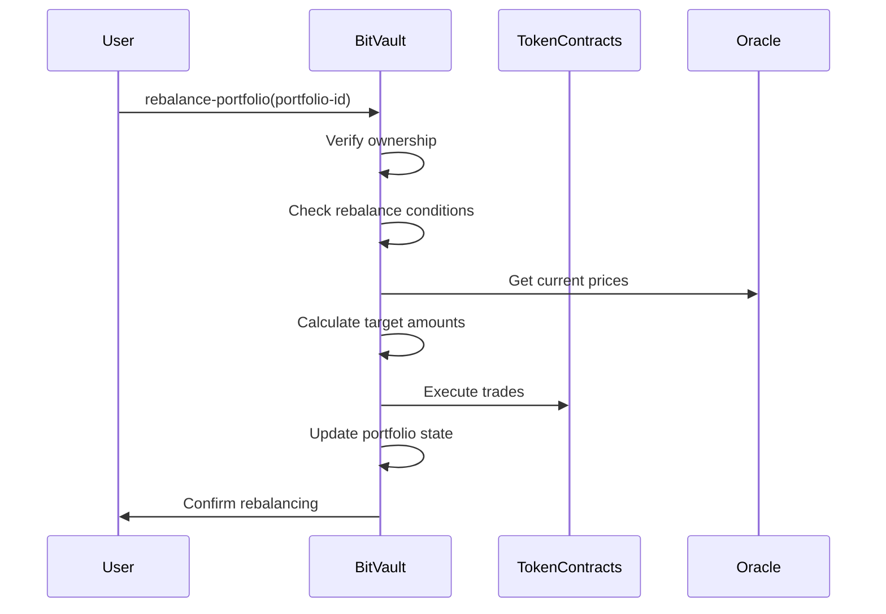

# BitVault Portfolio Manager

[](https://stacks.co)
[](https://bitcoin.org)
[](package.json)

> **Decentralized portfolio management protocol for Bitcoin Layer 2 ecosystems**

BitVault empowers users to create, manage, and automatically rebalance diversified cryptocurrency portfolios on the Stacks blockchain. Built with Bitcoin's security principles in mind, this protocol offers institutional-grade portfolio management tools while maintaining full user custody.

## Table of Contents

- [Features](#features)
- [System Overview](#system-overview)
- [Contract Architecture](#contract-architecture)
- [Data Flow](#data-flow)
- [Quick Start](#quick-start)
- [API Reference](#api-reference)
- [Contributing](#contributing)

## Features

### 🚀 Core Capabilities

- **Multi-Asset Portfolios**: Create diversified portfolios with up to 10 different tokens
- **Automated Rebalancing**: Smart contract-based rebalancing with customizable triggers
- **Percentage-Based Allocation**: Precise control over asset allocation percentages
- **User Portfolio Tracking**: Comprehensive portfolio history and management
- **Protocol Fee Structure**: Sustainable development with minimal fees (0.25%)
- **Bitcoin Layer 2 Native**: Built specifically for Stacks blockchain ecosystem

### 🔒 Security Features

- **Non-Custodial**: Users maintain full control of their assets
- **Comprehensive Validation**: Multi-layer error handling and input validation
- **Access Control**: Robust authorization mechanisms
- **Audit-Ready**: Clean, well-documented code structure

## System Overview

BitVault operates as a decentralized autonomous organization (DAO) for portfolio management on the Stacks blockchain. The system enables users to create sophisticated investment strategies while leveraging Bitcoin's security model.

```
┌─────────────────┐    ┌──────────────────┐    ┌─────────────────┐
│                 │    │                  │    │                 │
│     Users       │◄──►│   BitVault       │◄──►│   Token         │
│                 │    │   Protocol       │    │   Contracts     │
│                 │    │                  │    │                 │
└─────────────────┘    └──────────────────┘    └─────────────────┘
         │                       │                       │
         │              ┌──────────────────┐             │
         │              │                  │             │
         └──────────────►│   Stacks         │◄────────────┘
                        │   Blockchain     │
                        │                  │
                        └──────────────────┘
                               │
                        ┌──────────────────┐
                        │                  │
                        │   Bitcoin        │
                        │   Network        │
                        │                  │
                        └──────────────────┘
```

## Contract Architecture

### Core Components

#### 1. Data Storage Layer

```clarity
┌─────────────────────────────────────────────────────────────┐
│                    DATA STORAGE LAYER                       │
├─────────────────────────────────────────────────────────────┤
│  Portfolios Map          │  PortfolioAssets Map             │
│  ├─ Portfolio ID         │  ├─ {portfolio-id, token-id}     │
│  ├─ Owner                │  ├─ Target Percentage            │
│  ├─ Creation Time        │  ├─ Current Amount               │
│  ├─ Last Rebalanced      │  └─ Token Address                │
│  ├─ Total Value          │                                  │
│  ├─ Active Status        │  UserPortfolios Map              │
│  └─ Token Count          │  ├─ User Principal               │
│                          │  └─ Portfolio ID List            │
└─────────────────────────────────────────────────────────────┘
```

#### 2. Business Logic Layer

```clarity
┌─────────────────────────────────────────────────────────────┐
│                   BUSINESS LOGIC LAYER                     │
├─────────────────────────────────────────────────────────────┤
│  Portfolio Management    │  Asset Management               │
│  ├─ Create Portfolio     │  ├─ Add Assets                   │
│  ├─ Rebalance           │  ├─ Update Allocations           │
│  ├─ Update Config       │  └─ Validate Percentages         │
│  └─ Deactivate          │                                  │
│                          │  User Management                 │
│  Validation Layer        │  ├─ Track Portfolios             │
│  ├─ Input Validation     │  ├─ Authorization                │
│  ├─ Permission Checks    │  └─ Access Control               │
│  └─ State Verification   │                                  │
└─────────────────────────────────────────────────────────────┘
```

#### 3. Interface Layer

```clarity
┌─────────────────────────────────────────────────────────────┐
│                     INTERFACE LAYER                        │
├─────────────────────────────────────────────────────────────┤
│  Public Functions        │  Read-Only Functions             │
│  ├─ create-portfolio     │  ├─ get-portfolio                │
│  ├─ rebalance-portfolio  │  ├─ get-portfolio-asset          │
│  ├─ update-allocation    │  ├─ get-user-portfolios          │
│  └─ initialize           │  └─ calculate-rebalance-amounts  │
└─────────────────────────────────────────────────────────────┘
```

## Data Flow

### Portfolio Creation Flow



### Rebalancing Flow



### Data Access Patterns

```
User Query → Read-Only Functions → Data Maps → Response
     │              │                  │           │
     │              │                  │           └─ Formatted Data
     │              │                  └─ Raw Storage Access
     │              └─ No State Changes
     └─ Direct Blockchain Query
```

## Quick Start

### Prerequisites

- Stacks CLI installed
- Clarinet development environment
- Basic understanding of Clarity smart contracts

### Installation

```bash
# Clone the repository
git clone https://github.com/bitvault/portfolio-manager.git
cd portfolio-manager

# Install dependencies
npm install

# Start local development environment
clarinet console
```

### Basic Usage

#### Create a Portfolio

```clarity
;; Create a diversified portfolio with STX and BTC
(contract-call? .bitvault-portfolio create-portfolio 
    (list 'SP000000000000000000002Q6VF78.stx-token 
          'SP000000000000000000002Q6VF78.btc-token)
    (list u6000 u4000)) ;; 60% STX, 40% BTC
```

#### Rebalance Portfolio

```clarity
;; Trigger rebalancing for portfolio #1
(contract-call? .bitvault-portfolio rebalance-portfolio u1)
```

#### Query Portfolio

```clarity
;; Get portfolio information
(contract-call? .bitvault-portfolio get-portfolio u1)

;; Get user's portfolios
(contract-call? .bitvault-portfolio get-user-portfolios tx-sender)
```

## API Reference

### Public Functions

#### `create-portfolio`

Creates a new portfolio with specified token allocations.

**Parameters:**

- `initial-tokens`: List of token contract addresses (max 10)
- `percentages`: List of allocation percentages in basis points

**Returns:** Portfolio ID

#### `rebalance-portfolio`

Executes rebalancing for a specific portfolio.

**Parameters:**

- `portfolio-id`: Unique portfolio identifier

**Returns:** Success confirmation

#### `update-portfolio-allocation`

Updates target allocation for a specific asset.

**Parameters:**

- `portfolio-id`: Portfolio identifier
- `token-id`: Asset index within portfolio
- `new-percentage`: New target allocation in basis points

### Read-Only Functions

#### `get-portfolio`

Retrieves complete portfolio information.

#### `get-portfolio-asset`

Gets specific asset details within a portfolio.

#### `get-user-portfolios`

Returns list of portfolios owned by a user.

#### `calculate-rebalance-amounts`

Calculates required trades for rebalancing.

## Contributing

We welcome contributions from the community! Please read our [Contributing Guidelines](CONTRIBUTING.md) before submitting pull requests.

### Development Setup

```bash
# Fork and clone the repository
git clone https://github.com/grace-obong/bitvault-portfolio-manager.git

# Create a feature branch
git checkout -b feature/your-feature-name

# Make your changes and test
clarinet test

# Submit a pull request
```

---

### Built with ❤️ for the Bitcoin ecosystem
